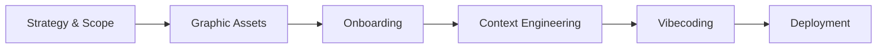
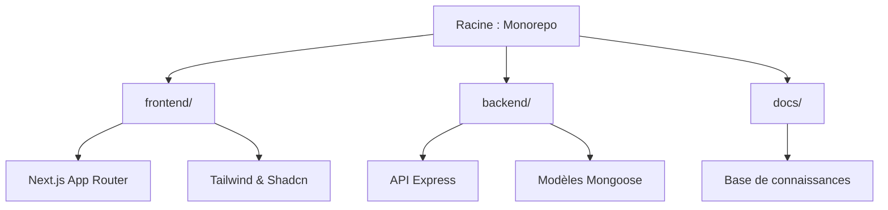

<!-- markdownlint-disable MD033 -->
<p align="center">
  
</p>

<p align="center">
  
  
  
  
</p>

<p align="center">
  
  
  
  
  
  
</p>
<!-- markdownlint-enable MD033 -->

Bienvenue dans le **manuel chronologique complet** du projet **DRYVIA**. Ce dépôt est une démonstration pratique de développement e-commerce fullstack moderne orchestré par l'IA (**Antigravity**).

DRYVIA révolutionne le marché des équipements de fitness avec la première **basket d'intérieur anti-transpiration** — conçue spécifiquement pour l'entraînement en studio (HIIT, Cross-training, Yoga) afin de garder vos pieds, vos chaussettes et vos tapis de gym parfaitement secs.

---

> [!IMPORTANT]
> **Définition du périmètre du MVP (Minimum Viable Product)** : 
> - Page d'accueil premium avec une narration axée sur l'éco-performance.
> - Boutique de produits à haute densité avec visualisation des données techniques.
> - Gestion sécurisée du panier avec calcul du total en temps réel.
> - Navigation optimisée Mobile-First pour les athlètes en studio.
> - **Zéro** surcharge de code hérité : architecture en pur TypeScript dès le premier jour.

Tous les prompts, la stratégie et la documentation sont disponibles dans le dossier [**docs**](/docs).

## Coeur Technique

| Couche | Implémentation |
|---|---|
| **Philosophie** |  |
| **Frontend** |    |
| **Backend** |   |
| **Orchestration** |   |

#### Cycle de vie du projet : Flux de travail du tableau de bord orchestré par l'IA


### Le Résultat Final
La mission : Transformer une vision stratégique en un tableau de bord Ligue 1 fonctionnel de qualité industrielle.

<div align="center">
  
</div>

---

## I. Cadrage Stratégique

Chaque projet commence par une **intention** claire. DRYVIA est né d'un problème vertical spécifique : l'inconfort et les problèmes d'hygiène liés à la transpiration des pieds pendant le fitness en salle. Nous avons défini un périmètre strict d'« Eco-Performance » à l'aide de notre [Brief Stratégique](docs/I.%20Strategic%20Framing/Strategy%20and%20Concept/Strategy%20and%20Concept.md).

### Étape 1.1 : Niche produit & Stratégie de solution
Nous avons identifié un manque sur le marché des chaussures de sport d'intérieur qui privilégient la gestion de l'humidité et l'hygiène. Notre stratégie se concentre sur une semelle technique anti-transfert d'humidité associée à des matériaux respirants et recyclés.

> **Extrait de [Concept & Stratégie](docs/I.%20Strategic%20Framing/Strategy%20and%20Concept/Strategy%20and%20Concept.md) :**
> - **Niche** : Chaussures de sport d'intérieur anti-transpiration pour les studios de fitness.
> - **Solution** : Semelle zéro-transfert + membrane antibactérienne anti-odeur.
> - **Objectif** : Garder les pieds, les chaussettes et les tapis de gym parfaitement secs.

<div align="center">
  
</div>

### Étape 1.2 : Création de l'identité de marque
Une fois la stratégie validée, nous avons défini l'ADN visuel de **DRYVIA** — un mélange entre la performance agressive de Nike et la précision minimaliste d'Apple. Le nom lui-même fait le pont entre le bénéfice (*Dry*) et le chemin parcouru (*Via*).

> **Extrait de [branding.md](docs/IV.%20Context%20Engineering/Contexte/MarkDowns/branding.md) :**
> - **Vibe** : Performance — Hygiène — Éco — Entraînement en intérieur.
> - **Positionnement** : « Le bon entraînement commence par vos pieds. »
> - **Slogan** : « Restez au sec. Entraînez-vous dur. »

<div align="center">
  
</div>

### Étape 1.3 : Synthèse stratégique finale
Toutes les recherches stratégiques — de la cartographie des profils cibles au positionnement concurrentiel — ont été synthétisées dans un schéma directeur visuel afin d'aligner les équipes techniques et créatives.

<div align="center">
  
</div>

---

## II. Collections Graphiques & Orchestration par l'IA

Pour éviter un effet « générique » ou vide, nous avons orchestré un ensemble complet de ressources de marque à l'aide de modèles d'IA haute fidélité. Chaque visuel respecte le système de design « Eco-Performance », garantissant une identité de marque cohérente sur toutes les vues du produit.

### Étape 2.1 : Tableau d'identité visuelle & Branding
Nous avons synthétisé nos principaux jetons de design — Noir Profond, Vert Néon et Bleu Frais — dans un tableau de branding complet qui sert de « source de vérité » pour l'intégration de l'interface utilisateur.

<div align="center">
  
</div>

### Étape 2.2 : Synthèse multimédia par l'IA (Images & Vidéos)
Au-delà de la charte graphique statique, nous avons exploité **Kling AI** pour concevoir un écosystème multimédia. Ce flux de travail permet de générer de façon clinique des photographies de produits ultra-cohérentes et des vidéos teasers de qualité industrielle.

<div align="center">
  
</div>

### Étape 2.3 : Bibliothèque de ressources techniques du produit
Pour offrir une transparence totale au consommateur, nous avons généré une bibliothèque technique complète à 360° pour la basket phare DRYVIA, montrant tous ses aspects, du tissu tech-mesh à la semelle anti-transpirante.

<div align="center">

| [**Vue de face**](docs/II.%20Graphic%20Collections/Assets/angle-front.png) | [**Vue latérale**](docs/II.%20Graphic%20Collections/Assets/side-view.png) | [**Semelle**](docs/II.%20Graphic%20Collections/Assets/sole-view.png) | [**Vue arrière**](docs/II.%20Graphic%20Collections/Assets/back-view.png) |
|---|---|---|---|
|  |  |  |  |
| [**Bannière Hero**](docs/II.%20Graphic%20Collections/Assets/hero-banner.png) | [**Style de vie Gym**](docs/II.%20Graphic%20Collections/Assets/gym-lifestyle.png) | [**Mesh technique**](docs/II.%20Graphic%20Collections/Assets/tech-mesh.png) | [**Identité Logo**](docs/II.%20Graphic%20Collections/Assets/logo-dark.png) |
|  |  |  |  |

</div>

### Étape 2.4 : Rendu final du design
La phase créative s'est achevée sur une image de synthèse finale, mettant en valeur le produit dans son contexte de haute performance, prête à être intégrée dans le frontend Next.js.

<div align="center">
  
</div>

---

## III. Ingénierie de Contexte : Le Cerveau de l'IA

Le développement assisté par IA dépend entièrement de la qualité de son contexte. Nous avons établi une « Base de connaissances » de spécifications techniques qui offre une clarté totale à l'agent de codage, garantissant que chaque décision d'architecture s'aligne sur la marque DRYVIA.

### Étape 3.1 : Prompt d'orchestration de l'IA
Nous avons utilisé l'**Ingénierie de Contexte** pour nourrir l'IA avec l'ADN précis du projet. En définissant des rôles et des contraintes clairs, nous avons transformé la vision stratégique en une documentation technique de qualité industrielle.

> **Extrait de [Prompt d'Orchestration](docs/IV.%20Context%20Engineering/Contexte/Prompt%20-%20Context%20Engineering.md) :**
> *"Act as a Senior Technical Writer & Project Scaffolding Specialist. Create a set of markdown files that will serve as the single source of truth for the 'DRYVIA' brand. Extract guidelines for branding, design systems, and product specifications. Ensure all content is professional, precise, and instruction-ready for developers."*

<div align="center">
  
</div>

### Étape 3.2 : Base de connaissances techniques
Le résultat de notre orchestration est une base de connaissances décentralisée. Ces fichiers servent de « source unique de vérité » pour les développeurs humains comme pour les agents d'IA :

- [**ADN de la marque**](docs/IV.%20Context%20Engineering/Contexte/MarkDowns/branding.md) : Règles d'identité visuelle et textuelle.
- [**Jetons de design**](docs/IV.%20Context%20Engineering/Contexte/MarkDowns/design_system.md) : Couleurs, typographie et échelles d'espacement.
- [**Données du produit**](docs/IV.%20Context%20Engineering/Contexte/MarkDowns/product_data.md) : Spécifications et modélisation du modèle phare.
- [**Contexte développeur**](docs/IV.%20Context%20Engineering/Contexte/MarkDowns/context.md) : Intentions architecturales fondamentales.
- [**Règles de projet**](docs/IV.%20Context%20Engineering/Contexte/MarkDowns/project_rules.md) : Normes de codage et logique de flux de travail.

---

## IV. Environnement de Développement & Outils

Le développement de qualité industrielle exige un environnement robuste et natif pour l'IA. Nous avons mis en place une configuration de poste de travail standardisée afin d'assurer une synchronisation parfaite entre la machine locale, le dépôt cloud et nos outils d'orchestration de l'IA.

### Étape 4.1 : Fondations du contrôle de version (Téléchargement de Git)
Avant d'écrire la moindre ligne de code, nous avons accédé au portail officiel de **Git** pour acquérir la dernière version de ce système standard de contrôle de version.

<div align="center">
  
</div>

### Étape 4.2 : Configuration de l'installateur
Nous avons exécuté l'installateur de Git avec des paramètres optimisés pour le développement industriel, garantissant que notre ligne de commande locale soit parfaitement alignée avec les exigences du projet DRYVIA.

<div align="center">
  
</div>

### Étape 4.3 : Dépôt collaboratif Cloud (GitHub)
Pour héberger le code source de DRYVIA et permettre des déploiements orchestrés par l'IA, nous avons configuré un compte professionnel **GitHub**, reliant notre travail local à la communauté mondiale des développeurs.

<div align="center">
  
</div>

### Étape 4.6 : Acquisition de l'IDE natif IA (Trae)
Le cœur de notre flux de travail est l'**IDE Trae** — l'éditeur de nouvelle génération orienté IA. Nous avons téléchargé sa version stable pour exploiter pleinement ses capacités de « Vibe Coding » à haute vitesse.

<div align="center">
  
</div>

### Étape 4.7 : Bienvenue dans le futur du développement
L'écran d'accueil de Trae marque la transition entre le développement traditionnel et un espace de travail orchestré par l'IA, conçu pour une vitesse d'ingénierie maximale.

<div align="center">
  
</div>

### Étape 4.8 : Authentification sécurisée de l'appareil
La sécurité est essentielle. Nous avons effectué une vérification sécurisée de l'appareil pour lier notre instance de Trae à notre identité numérique, garantissant un environnement de création sûr.

<div align="center">
  
</div>

### Étape 4.9 : Synchronisation avec le dépôt distant
Nous avons initié le premier clonage du dépôt DRYVIA directement dans Trae, important nos fondations stratégiques du cloud vers notre cockpit d'IA local.

<div align="center">
  
</div>

### Étape 4.10 : Activation de l'interface Builder
L'étape finale de la configuration de notre environnement : l'activation de l'interface **Trae Builder**, où le contexte stratégique et l'architecture du code prennent véritablement vie.

<div align="center">
  
</div>

---

## V. Architecture Fullstack & Arborescence

La transition de la conception conceptuelle vers une infrastructure de qualité industrielle est orchestrée via un échafaudage automatisé. Nous avons établi une structure de projet « IA-Transparente », offrant une clarté totale à l'agent de développement pendant la phase de construction.

### Étape 5.1 : Exécution de l'échafaudage automatisé (Scaffolding)
Pour garantir un environnement standardisé et sans erreurs, nous avons utilisé un **script d'échafaudage Bash** personnalisé. Cette automatisation crée l'architecture découplée complète (Frontend, Backend, Docs) en quelques millisecondes.

> **Extrait de [create_structure.sh](create_structure.sh) :**
> ```bash
> #!/bin/bash
> mkdir -p backend frontend docs
> mkdir -p backend/{config,controllers,middleware,models,routes,services,utils}
> mkdir -p frontend/src/{app,components/{layout,ui},features/products,lib,providers,types}
> ```

<div align="center">
  
</div>

```bash
# Option A : Linux / macOS / Git Bash
bash create_structure.sh

# Option B : Windows (PowerShell)
PowerShell -ExecutionPolicy Bypass -File create_structure.ps1
```

#### Schéma de l'arborescence souhaitée
La structure finale suit une séparation stricte des préoccupations, optimisée pour l'ingénierie assistée par l'IA :

```text
e-commerce/
├── backend/            # API Express (TS)
│   ├── controllers/    # Logique métier
│   ├── models/         # Modèles de données
│   └── routes/         # Routes d'API
├── frontend/           # Next.js 14 (App Router)
│   ├── src/app/        # Pages & Routage
│   ├── src/components/ # Éléments d'interface UI
│   └── src/features/   # Logique spécifique au produit
└── docs/               # Base de connaissances principale (Knowledge Base)
```

### Étape 5.2 : Validation & Vérification de la hiérarchie
Une fois le squelette généré, nous effectuons une vérification approfondie à l'aide de la commande `tree`. Cette étape confirme que chaque répertoire et fichier de configuration est correctement positionné pour la suite.

<div align="center">
  
</div>

### Étape 5.3 : Livrable de l'infrastructure architecturale
La phase d'échafaudage se termine avec un environnement local entièrement synchronisé, constituant le livrable définitif pour notre phase d'ingénierie structurelle.

<div align="center">
  
</div>

---

## VI. Vibe-Coding Industriel : La Phase de Développement

La phase de **Vibecoding** est celle où l'architecture s'enrichit d'une logique métier robuste. Une fois l'environnement configuré et la structure vadidée, nous passons du plan d'action à la programmation active.

> **Prompt d'Orchestration Stratégique (Entrée IA) :**
> *"Act as a Senior Fullstack Engineer. Implement a decoupled Next.js & Express architecture for the DRYVIA Store. Prioritize the 'Zero-Product Shield' using local fallbacks. The aesthetic must follow the 'Eco-Performance' design system: Deep Black surfaces with Neon Green highlights. Build for performance and athletes."*

---

### Étape 6.1 : Commandes de lancement
Pour s'assurer que toutes les couches (Frontend, Backend, Base de connaissances) sont parfaitement synchronisées en cours de développement, nous utilisons des commandes standardisées pour lancer l'ensemble de l'écosystème simultanément.

<div align="center">
  
</div>

```bash
# Lancer l'écosystème complet en mode développement
# Cela lance Next.js et l'API Express
npm run dev
```

### Étape 6.2 : Session de Vibe-Coding en direct
Armés de notre **stratégie de développement**, nous entamons une phase de production rapide. Cette session convertit les exigences techniques en un produit fonctionnel via la création autonome d'interfaces et l'intégration des APIs.

<div align="center">
  
</div>

### Étape 6.3 : Architecture technique & Hiérarchie
Le résultat de cette session est une structure de monorepo découplée très robuste. Chaque module possède une responsabilité claire et isolée.

---

#### Graphe Système


#### Arborescences Finales du Projet

**Structure Racine**
```text
e-commerce/
├── backend/            # Couche API (Express/TS)
├── frontend/           # Couche UI (Next.js 14)
├── docs/               # Stratégie & Documentation
├── package.json        # Workspace unifié (Monorepo)
└── create_structure.sh # Script d'échafaudage
```

**Structure Backend**
```text
backend/
├── app.ts              # Coeur Express
├── controllers/        # Contrôleurs logiques
├── models/             # Schémas Mongoose
└── routes/             # Définitions des routes API
```

> **Exemple de Route (`products.routes.ts`) :**
> ```typescript
> router.get('/', getProducts);
> router.get('/:slug', getProductBySlug);
> ```

**Structure Frontend**
```text
frontend/src/
├── app/                # Layouts & Routage (App Router)
├── components/         # Éléments de design atomique
├── features/           # Logique du panier & paiement
└── providers/          # Fournisseurs de contextes globaux
```

> **Implémentation de l'Accueil (`app/page.tsx`) :**
> ```tsx
> export default function Home() {
>   return (
>     <section className="relative h-screen flex items-center...">
>       {/* Récit de marque à haute performance */}
>     </section>
>   );
> }
> ```

### Étape 6.4 : Finalisation de la gestion de version
Une fois la session de Vibe-Coding en état de livraison pour la production, nous effectuons une synchronisation finale avec le cloud pour pousser l'ensemble de la base de code sur GitHub.

**Commandes (premier envoi depuis le local) :**

```bash
git init
git remote add origin git@github.com:USERNAME/e-commerce.git
git add .
git commit -m 'my first commit'
git push -u origin main
```

<div align="center">
  
</div>

---

## VII. Production & Déploiement Cloud

Le passage en production est la validation ultime de notre flux technique. Nous utilisons l'orchestration de Vercel pour rendre la boutique DRYVIA disponible à l'échelle mondiale.

### Étape 7.1 : Initialisation du projet Vercel
Nous lançons le processus de déploiement en liant notre dépôt GitHub fraîchement configuré à Vercel, établissant ainsi l'environnement de production et les paramètres de compilation.

<div align="center">
  
</div>

### Étape 7.2 : Validation de la compilation (Build)
Vercel exécute le processus de compilation, validant notre code TypeScript et générant les fichiers optimisés pour la production. Une compilation réussie donne le feu vert pour la mise en ligne du site.

<div align="center">
  
</div>

### Étape 7.3 : Suivi du tableau de bord de production
Après la compilation, le tableau de bord de Vercel offre une vue centralisée sur l'état de la production, les mesures de performance et l'URL de staging active.

<div align="center">
  
</div>

### Étape 7.4 : Le résultat industriel final
La mission est accomplie. L'expérience e-commerce **DRYVIA** est en ligne, proposant une boutique haut de gamme de baskets d'entraînement anti-transpirantes aux athlètes du monde entier.

**Lien de production** : [https://e-commerce-frontend-red-eight.vercel.app/](https://e-commerce-frontend-red-eight.vercel.app/)

<div align="center">
  <p align="center">
    <a href="https://e-commerce-frontend-red-eight.vercel.app/">
      
    </a>
  </p>
</div>

---

## 🏆 Statut de la Mission : COMPLÉTÉE
**État actuel** : Écosystème Fullstack Déployé à 100%.

*Ce dépôt sert de modèle pour l'ingénierie orchestrée par l'IA. Nous avons transformé une vision stratégique en un projet e-commerce fonctionnel de qualité industrielle grâce à une ingénierie de contexte précise et une implémentation rapide.*